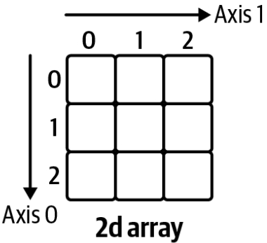

# Chapter 4. NumPy Foundations
NumPy is the core package for scientific computing in Python and is the backbone of pandas. 
## Getting Started with NumPy

### NumPy Array
To perform array-based calculations with nested lists you would have to write some sort of loop. For example...

```python
matrix = [[1, 2, 3],
          [4, 5, 6],
          [7, 8, 9]]

print([[i+1 for i in row] for row in matrix])

Out: [[2, 3, 4], [5, 6, 7], [8, 9, 10]]
```

This isn't very readable and can become slow with with very large arrays. Using NumPy arrays instead of Python lists can make your calculations a couple to hundred times faster. 

Let's create a one- and two-dimensional array to work with throughout this chapter:

```python
# First, import NumPy
import numpy as np

# Constructing an array with a simple list results in a 1d array
array1 = np.array([10, 100, 1000.])

# Constructing an array with a nested list results in a 2d array
array2 = np.array([[1., 2., 3.,],
                   [4., 5., 6.]])
```

### Vectorization and Broadcasting
If you build the sum of a scalar and a NumPy array, NumPy will perform an element-wise operation, which means that you don't have to loop through the elements yourself. This is called *vectorization*. 

```python
array2 + 2

Out: array([[2., 3., 4.],
            [5., 6., 7.]])
```

The same principle applies when you work with two arrays: NumPy performs the operation element-wise:

```python
array2 * array2

Out: array([[1., 4., 9.]
            [16., 25., 36.]])
```

If you use two arrays with different shapes in an arithmetic operation, NumPy extends - if possible - the smaller array automatically across the larger array so that their shapes become compatible. This is called *broadcasting*. 

```python
array2 * array1

Out: array([[10., 200., 3000.]
            [40., 500., 6000.]])
```

To perform matrix multiplications or dot products, use the @ operator:

```python
array2 @ array2.T # array2.T is a shortcut for array2.transpose()

Out: array([[14., 32.]
            [32., 77.]])
```

### Universal Functions (ufunc)
*Universal functions* (ufunc) work on every element in a NumPy array. For example, if you use Python's standard square root function form the <span style="font-family:monospace;">math</span> module on a NumPy array, you will gen an error. 

```python
import math

math.sqrt(array2) # This will raise a TypeError
```

You could of course write a nested loop to get the square root of every element, then build a NumPy array again from the result:

```python
np.array([[math.sqrt(i) for i in row] for row in array2])

Out: array([[1., 1.414, 1.732],
            [2., 2.236, 2.449]])
```

This will if NumPy doesn't have a ufunc. However, if it does, then using the ufunc will be much faster and easier to type and read. 

```python
np.sqrt(array2)

Out: array([[1., 1.414, 1.732],
            [2., 2.236, 2.449]])
```

Some of NumPy's ufuncs, like sum, are additionally available as array methods: if you want the sum of each column, do the following:

```python
array2.sum(axis=0)

Out: array([5., 7., 9.])
```

The argument <span style="font-family:monospace;">axis=0</span> refers to the axis along the rows while <span style="font-family:monospace;">axis=1</span> refers to the axis along the columns. 



Leaving the <span style="font-family:monospace;">axis</span> argument away sums up the whole array:

```'python
array2.sum()

Out: 21.0
```

## Creating and Manipulating Arrays

### Getting and Setting Array Elements
When working with nested lists, like <span style="font-family:monospace;">matrix</span> from eariler, you can use *chained indexing*: <span style="font-family:monospace;">matrix[0][0]</span> will get you the first element of the first row. With NumPy arrays, however, you provide the index and slice arguments for both dimensions in a single pair of square brackets:

```python
numpy_array[row_selection, column_selection]
```

For one-dimensional arrays, this simplifies to <span style="font-family:monospace;">numpy_array[selection]</span>. 

Remember that slice notation uses a start index (included) and an end index (excluded) with a colon in between. 

Remember, by slicing a column or row of a two-dimensional array, you end up with a one-dimensional array, not with a two-dimensional column or row vector!

```python
array[1] # Returns a scalar

Out: 1000.0

array2[0,0] # Returns a scalar

Out: 1.0

array2[:, 1:] # Returns a 2d array

Out: array([[2., 3.],
            [5., 6.]])

array2[:, 1] # Returns a 1d array

Out: array([2., 5.])

array2[1, :2] # Returns a 1d array

Out: array([4., 5.])
```

### Useful Array Constructors
One way to easily create arrays is to use the <span style="font-family:monospace;">arange</span> function. This stands for *array range* and is similar to the built-in <span style="font-family:monospace;">range</span> with the difference that <span style="font-family:monospace;">arange</span> returns a NumPy array. Combining it with <span style="font-family:monospace;">reshape</span> allows us to quickly generate an array with the desired dimensions:

```python
np.arange(2 * 5).reshape(2, 5) # 2 rows, 5 columns

Out: array([[0, 1, 2, 3, 4]
            [5, 6, 7, 8, 9]])
```

Another common need, for example for Monte Carlo simulations, is to generate arrays of normally distributed pseudorandom numbers. NumPy makes this easy. 

```python
np.random.randn(2, 3) # 2 rows, 3 columns

Out: array([[-0.30, -1.20, -0.14],
            [ 1.06,  0.03, -1.22]])
```

### View vs. Copy
NumPy arrays return *views* when you slice them. This means that you are working with a subset of the original array without copying the data. Setting a value on a view will therefore also change the original array:

```python
array2

Out: array([[1., 2., 3.],
            [4., 5., 6.]])

subset = array2[:, :2]

subset

Out: array([[1., 2.],
            [4., 5.]])

subset[0, 0] = 1000

subset

Out: array([[1000., 2.],
            [   4., 5.]])

array2

Out: array([[1000., 2., 3.],
            [   4., 5., 6.]])
```

If that's not what you want, you would have to change <span style="font-family:monospace;">subset</span> as follows:

```python
subset = array2[:, :2].copy()
```

Working on a copy will leave the original array unchanged. 

## Conclusion
While NumPy is an incredibly powerful library, there are two main issues when you want to use it for data analysis:
- The whole NumPy array needs to be of the same data type. As soon as text is involved, the array will have the data type <span style="font-family:monospace;">object</span>, which will not allow mathematical operations. 
- Using NumPy arrays for data analysis makes it hard to know what each colo=umn or row refers to because you typically select columns via their position.

pandas has solved these issues by providing smarter data structures on top of NumPy arrays. 
